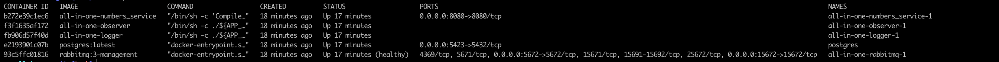
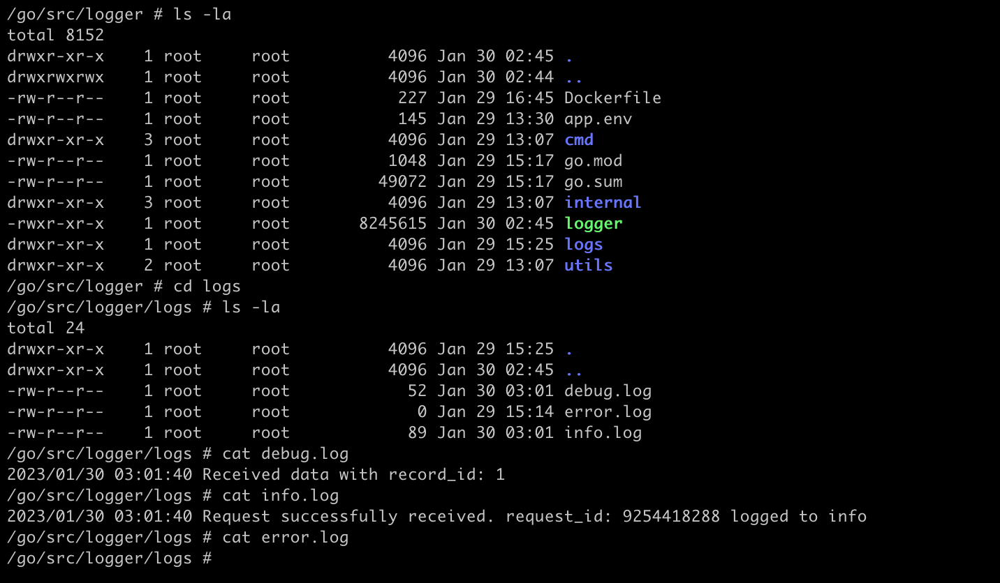
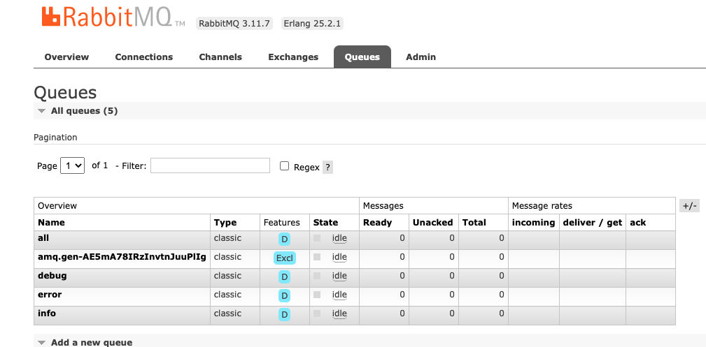

# Test Task

# RUN

```
docker-compose up -d --build 
```

OR 
```
make
```

## After compose docker run:
```
docker ps
```




### To check database rows write:
```
docker exec -it <postgres_hash_id> sh
```
```
psql -U postgres
```
```
\d
```
```
SELECT * FROM numbers;
```

### To check logs write:
```
docker exec -it <numbers_hash_id> sh
```

```
ls -la
cd logs
ls -la

cat info.log
cat error.log
cat debug.log
```




### Queues:
